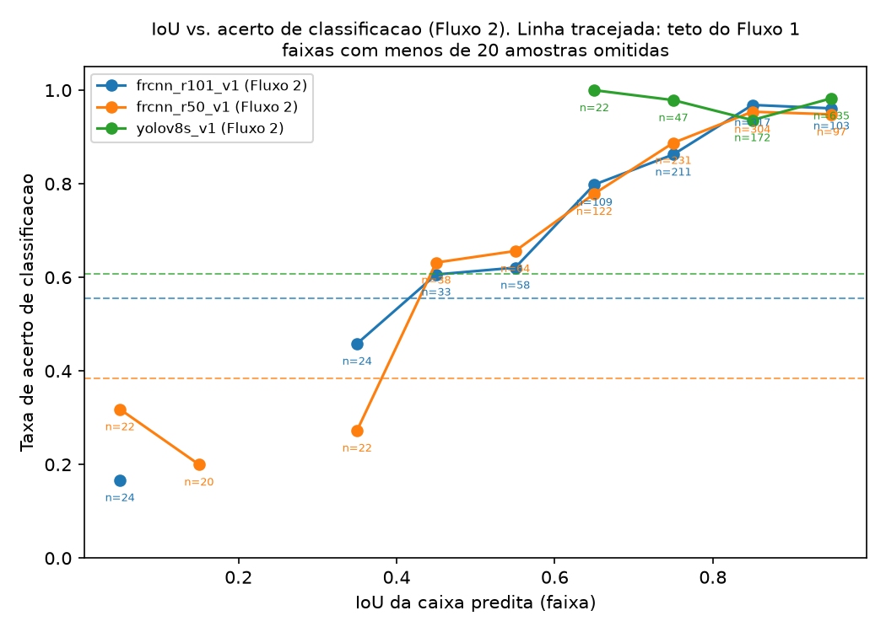
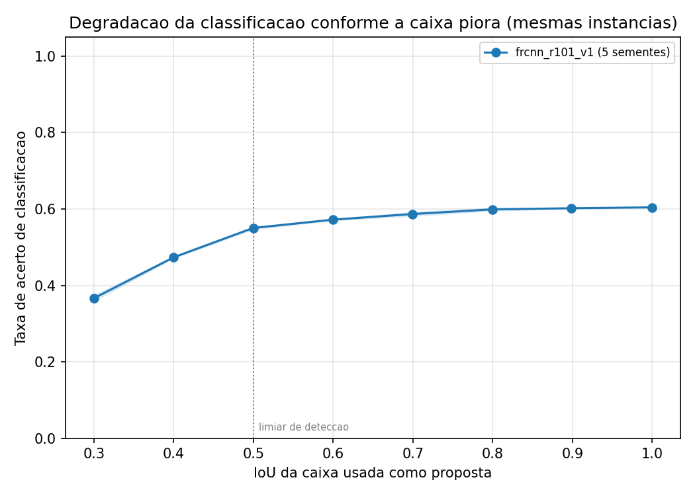
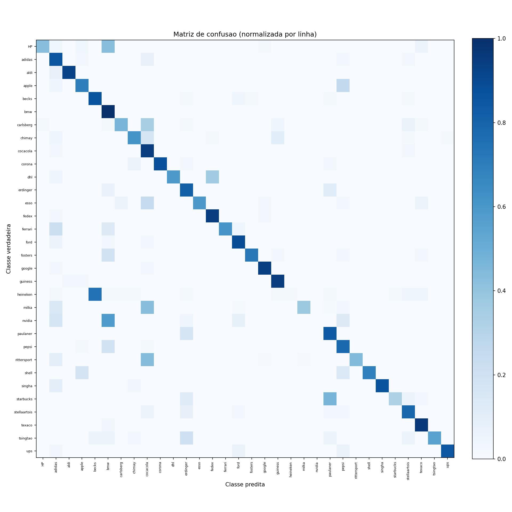
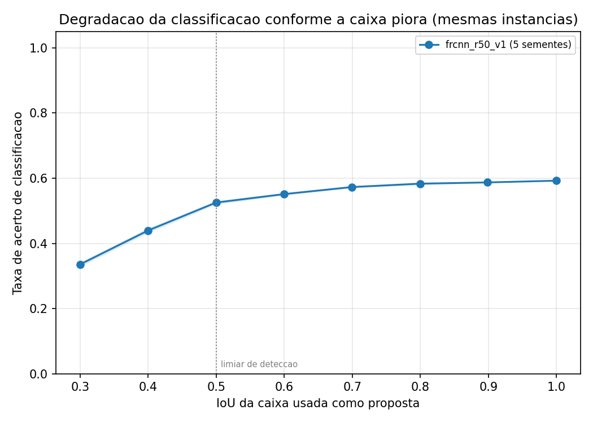
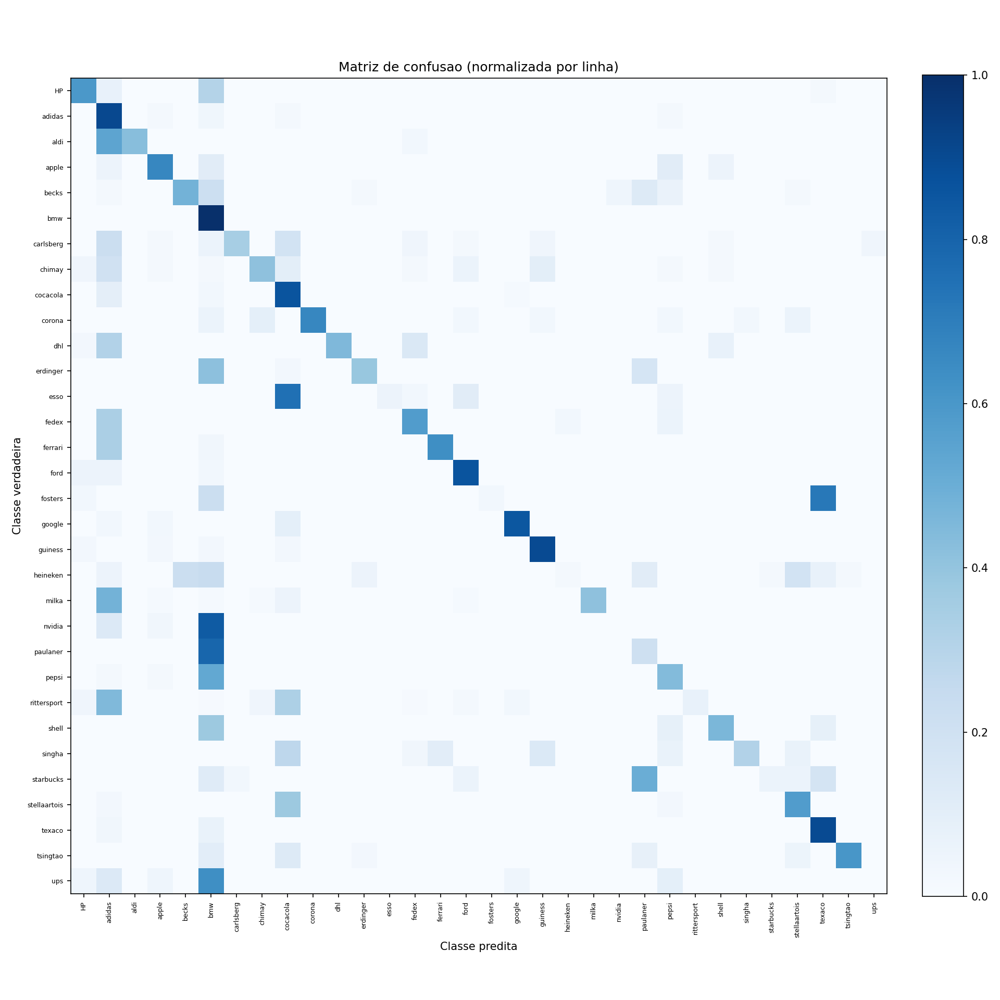
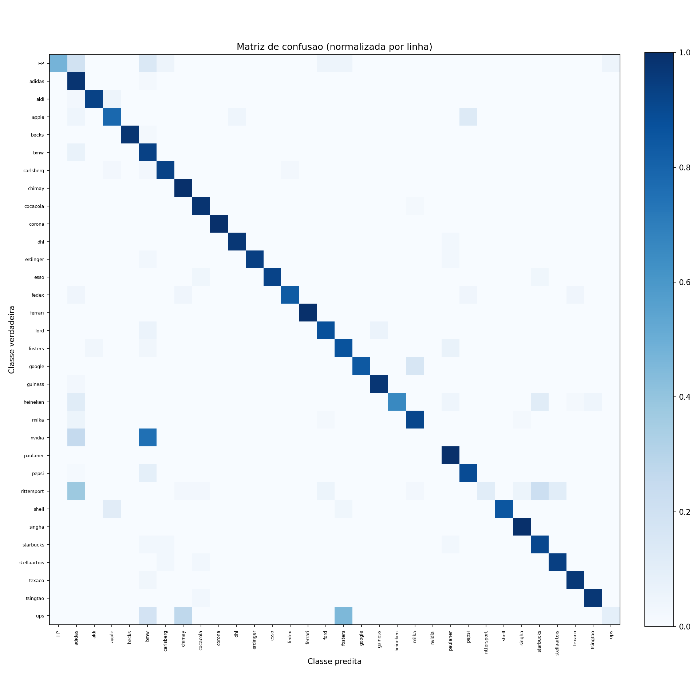

# Relatorio de resultados: deteccao de logotipos

Gerado em 2026-09-23 19:53.

## Dataset

| parametro | valor |
| --- | --- |
| nome | FlickrLogos-32 |
| classes | 32 |
| treino_por_classe | 10 |
| validacao_por_classe | 30 |
| teste_por_classe | 30 |
| sem_logo_teste | 3000 |

## Comparacao entre modelos

| modelo | fluxo1_acuracia | fluxo1_taxa_falha_deteccao | fluxo1_acuracia_dado_deteccao | fluxo1_acuracia_sem_padding | fluxo1_f1_macro | fluxo2_mAP@0.5 | fluxo2_precisao | fluxo2_revocacao | fluxo2_f1 | fluxo2_iou_medio_vp | fluxo2_acuracia_classif_dado_localizado | fluxo2_pct_erro_localizacao | fluxo2_pct_erro_classificacao | fluxo2_pct_erro_ambos | fluxo2_pct_deteccao_perdida | fluxo2_pct_falso_positivo_fundo |
| --- | --- | --- | --- | --- | --- | --- | --- | --- | --- | --- | --- | --- | --- | --- | --- | --- |
| frcnn_r101_v1 | 0.554 | 0.173 | 0.670 | 0.314 | 0.621 | 0.497 | 0.507 | 0.475 | 0.491 | 0.794 | 0.700 | 0.051 | 0.206 | 0.088 | 0.532 | 0.111 |
| frcnn_r50_v1 | 0.383 | 0.169 | 0.461 | 0.170 | 0.421 | 0.501 | 0.467 | 0.481 | 0.474 | 0.786 | 0.675 | 0.059 | 0.217 | 0.096 | 0.486 | 0.129 |
| yolov8s_v1 | 0.607 | 0.309 | 0.879 | 0.459 | 0.711 | 0.584 | 0.794 | 0.542 | 0.644 | 0.910 | 0.970 | 0.017 | 0.028 | 0.004 | 0.765 | 0.186 |

## frcnn_r101_v1

### Fluxo 1: classificacao com localizacao ideal

| parametro | valor |
| --- | --- |
| acuracia | 0.554 |
| f1_macro | 0.621 |
| taxa_falha_deteccao | 0.173 |

Variante sem padding (sensibilidade):

| parametro | valor |
| --- | --- |
| acuracia | 0.314 |
| f1_macro | 0.343 |

### Fluxo 2: deteccao ponta a ponta

IoU >= 0.5:

| parametro | valor |
| --- | --- |
| mAP | 0.497 |
| precisao | 0.507 |
| revocacao | 0.475 |
| f1 | 0.491 |
| vp | 761 |
| fp | 739 |
| fn | 841 |
| iou_medio_vp | 0.794 |

IoU >= 0.75:

| parametro | valor |
| --- | --- |
| mAP | 0.341 |
| precisao | 0.359 |
| revocacao | 0.336 |
| f1 | 0.348 |
| vp | 539 |
| fp | 961 |
| fn | 1063 |
| iou_medio_vp | 0.847 |

### Decomposicao de erro (Fluxo 2)

| parametro | valor |
| --- | --- |
| true_positive | 761 |
| classification_error | 326 |
| localization_error | 81 |
| both_error | 139 |
| duplicate | 18 |
| background_error | 175 |
| missed | 841 |

### Sensibilidade ao erro de localizacao

Caixas anotadas perturbadas ate niveis controlados de IoU e injetadas na RoI head.
As mesmas instancias aparecem em todos os niveis.
Media de 5 sementes de perturbacao; acuracia_std e o desvio padrao entre sementes.

| nivel_alvo | n | iou_medio | acuracia | acuracia_std | taxa_acima_limiar | taxa_fundo_vence |
| --- | --- | --- | --- | --- | --- | --- |
| 1.000 | 1602 | 1.000 | 0.604 | 0.000 | 0.511 | 0.499 |
| 0.900 | 1602 | 0.898 | 0.602 | 0.002 | 0.508 | 0.506 |
| 0.800 | 1602 | 0.800 | 0.599 | 0.005 | 0.488 | 0.527 |
| 0.700 | 1602 | 0.700 | 0.587 | 0.006 | 0.446 | 0.575 |
| 0.600 | 1602 | 0.600 | 0.572 | 0.003 | 0.355 | 0.680 |
| 0.500 | 1602 | 0.500 | 0.550 | 0.005 | 0.174 | 0.878 |
| 0.400 | 1602 | 0.400 | 0.474 | 0.004 | 0.019 | 0.989 |
| 0.300 | 1602 | 0.300 | 0.366 | 0.009 | 0.004 | 0.996 |

taxa_acima_limiar: fracao de caixas cujo score de classe passa do limiar de confianca do detector, ou seja, que virariam uma deteccao emitida.

Queda de 0.238 na acuracia entre a caixa anotada (IoU 1.0) e IoU 0.3.

### Configuracao do treino

| parametro | valor |
| --- | --- |
| epocas | 30 |
| tempo_treino | 60.2 min |
| observacao | treino retomado da epoca 16; o tempo acima cobre apenas as 14 epocas desta sessao |
| gpu | Tesla T4, 15360 MiB |
| cuda_disponivel | True |
| torch | 2.11.0+cu128 |

## frcnn_r50_v1

### Fluxo 1: classificacao com localizacao ideal

| parametro | valor |
| --- | --- |
| acuracia | 0.383 |
| f1_macro | 0.421 |
| taxa_falha_deteccao | 0.169 |

Variante sem padding (sensibilidade):

| parametro | valor |
| --- | --- |
| acuracia | 0.170 |
| f1_macro | 0.174 |

### Fluxo 2: deteccao ponta a ponta

IoU >= 0.5:

| parametro | valor |
| --- | --- |
| mAP | 0.501 |
| precisao | 0.467 |
| revocacao | 0.481 |
| f1 | 0.474 |
| vp | 771 |
| fp | 880 |
| fn | 831 |
| iou_medio_vp | 0.786 |

IoU >= 0.75:

| parametro | valor |
| --- | --- |
| mAP | 0.319 |
| precisao | 0.315 |
| revocacao | 0.325 |
| f1 | 0.320 |
| vp | 520 |
| fp | 1131 |
| fn | 1082 |
| iou_medio_vp | 0.845 |

### Decomposicao de erro (Fluxo 2)

| parametro | valor |
| --- | --- |
| true_positive | 771 |
| classification_error | 371 |
| localization_error | 101 |
| both_error | 165 |
| duplicate | 23 |
| background_error | 220 |
| missed | 831 |

### Sensibilidade ao erro de localizacao

Caixas anotadas perturbadas ate niveis controlados de IoU e injetadas na RoI head.
As mesmas instancias aparecem em todos os niveis.
Media de 5 sementes de perturbacao; acuracia_std e o desvio padrao entre sementes.

| nivel_alvo | n | iou_medio | acuracia | acuracia_std | taxa_acima_limiar | taxa_fundo_vence |
| --- | --- | --- | --- | --- | --- | --- |
| 1.000 | 1602 | 1.000 | 0.592 | 0.000 | 0.514 | 0.500 |
| 0.900 | 1602 | 0.898 | 0.587 | 0.001 | 0.507 | 0.505 |
| 0.800 | 1602 | 0.800 | 0.583 | 0.004 | 0.484 | 0.529 |
| 0.700 | 1602 | 0.700 | 0.573 | 0.003 | 0.436 | 0.588 |
| 0.600 | 1602 | 0.600 | 0.551 | 0.004 | 0.345 | 0.697 |
| 0.500 | 1602 | 0.500 | 0.525 | 0.006 | 0.165 | 0.887 |
| 0.400 | 1602 | 0.400 | 0.440 | 0.007 | 0.024 | 0.987 |
| 0.300 | 1602 | 0.300 | 0.335 | 0.007 | 0.006 | 0.996 |

taxa_acima_limiar: fracao de caixas cujo score de classe passa do limiar de confianca do detector, ou seja, que virariam uma deteccao emitida.

Queda de 0.257 na acuracia entre a caixa anotada (IoU 1.0) e IoU 0.3.

### Configuracao do treino

| parametro | valor |
| --- | --- |
| epocas | 30 |
| tempo_treino | 98.1 min |
| gpu | Tesla T4, 15360 MiB |
| cuda_disponivel | True |
| torch | 2.11.0+cu128 |

## yolov8s_v1

### Fluxo 1: classificacao com localizacao ideal

| parametro | valor |
| --- | --- |
| acuracia | 0.607 |
| f1_macro | 0.711 |
| taxa_falha_deteccao | 0.309 |

Variante sem padding (sensibilidade):

| parametro | valor |
| --- | --- |
| acuracia | 0.459 |
| f1_macro | 0.558 |

### Fluxo 2: deteccao ponta a ponta

IoU >= 0.5:

| parametro | valor |
| --- | --- |
| mAP | 0.584 |
| precisao | 0.794 |
| revocacao | 0.542 |
| f1 | 0.644 |
| vp | 868 |
| fp | 225 |
| fn | 734 |
| iou_medio_vp | 0.910 |

IoU >= 0.75:

| parametro | valor |
| --- | --- |
| mAP | 0.542 |
| precisao | 0.745 |
| revocacao | 0.508 |
| f1 | 0.604 |
| vp | 814 |
| fp | 279 |
| fn | 788 |
| iou_medio_vp | 0.926 |

### Decomposicao de erro (Fluxo 2)

| parametro | valor |
| --- | --- |
| true_positive | 868 |
| classification_error | 27 |
| localization_error | 16 |
| both_error | 4 |
| duplicate | 0 |
| background_error | 178 |
| missed | 734 |

